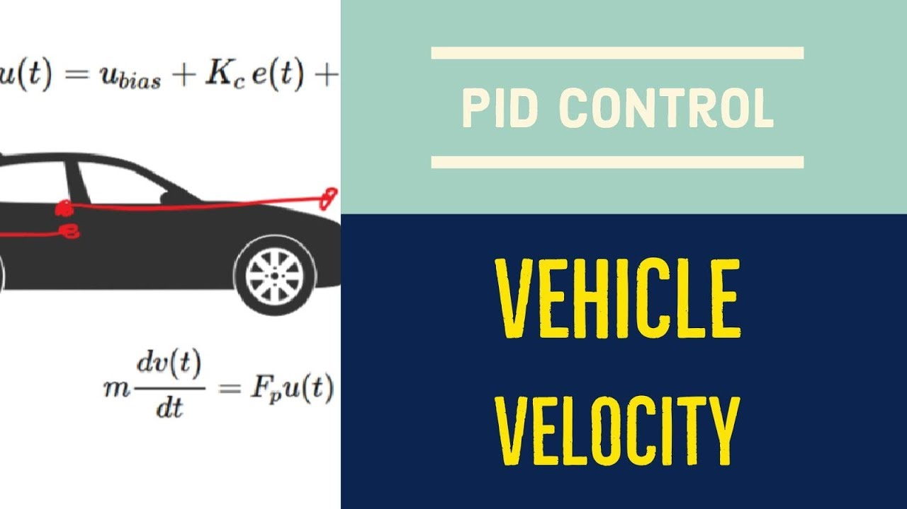
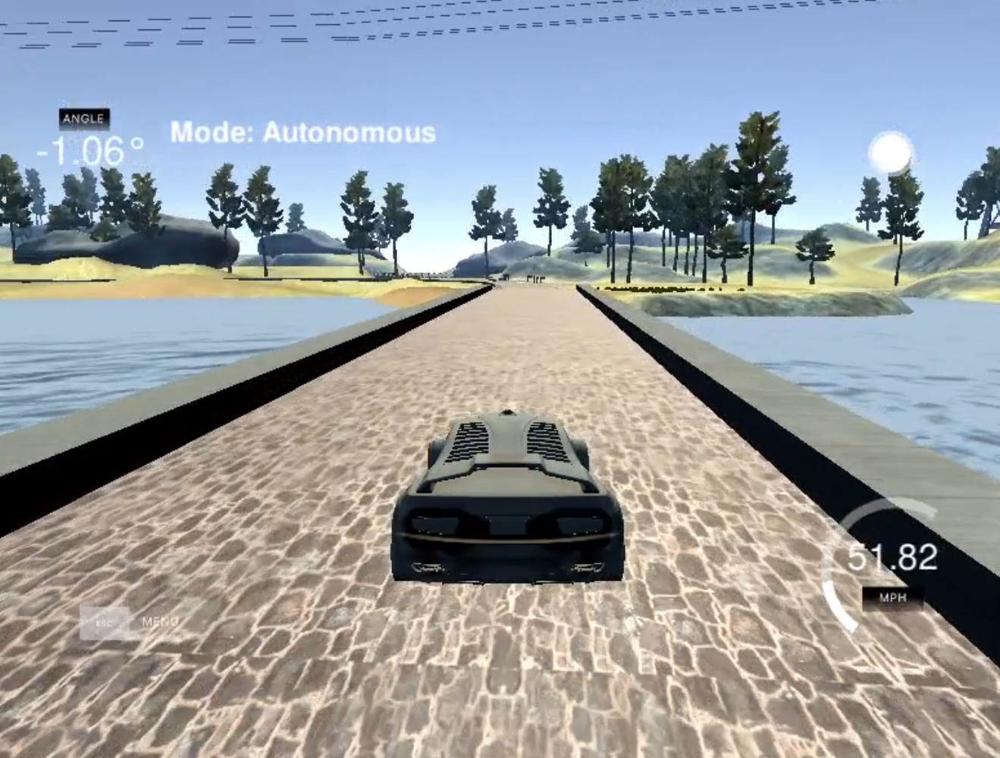

# CarND-Controls-PID
[](http://www.udacity.com/drive)

 

## **Overview**
In the next project, I implemented a PID controller with an interesting algorithm to tune the proportional, integral and derivatives constants called Twiddle. The main objective is drive a car into the Udacity simulator to control the steering angle in the virtual track.

## **Project Description**

A proportional–integral–derivative controller is a control loop feedback mechanism widely used in industrial control systems and a variety of other applications requiring continuously modulated control. A PID controller continuously calculates an error value as the difference between a desired set point and a measured process variable and applies a correction based on proportional, integral, and derivative terms. 

### 1 - PID Theory:

* Proportional constant

    Is one of the most important constants to control the steering angle. This constant is proportional to the current set point (line center) For example, if the error is large and positive, the control output will be proportionately large and positive, taking into account the gain factor "K". Using proportional control alone will result in an error between the set point and the actual process value, because it requires an error to generate the proportional response. If there is no error, there is no corrective response.

* Differential constant

    This term refers to estimate the future trend of the set point,  based on its current rate of change. It is sometimes called "anticipatory control", as it is effectively seeking to reduce the effect of the overshoot generated by the rate of error change. The more rapid the change, the greater the controlling or dampening effect.

* Integral constant 

    This term accounts for past values of the Set point error and integrates them over time to produce the I term. For example, if there is a residual error after the application of proportional control, the integral term seeks to eliminate the residual error by adding a control effect due to the historic cumulative value of the error. When the error is eliminated, the integral term will cease to grow. This will result in the proportional effect diminishing as the error decreases, but this is compensated for by the growing integral effect.

### 2 - PID parameters:

Hyper-parameters were manually tuned. First I implemented a PID controller for the car's throttle to follow a speed reference around the track no matter the disturbances. The throttle PID controller is fed with the error (`speed_cte`) between the current speed (`json_speed`) and the reference speed (`desired_speed`). 

I used the next procedure which is a good baseline tune to get a good response to disturbances and tune a PID controller: 

1. Set all gains to zero.
2. Increase the P (`Kp_`) gain until the response to a disturbance is steady oscillation.
3. Increase the D (`Kd_`) gain until the the oscillations go away (Critically damped).
4. Repeat steps 2 and 3 until increasing the D (`Kd_`) gain does not stop the oscillations.
5. Set P (`Kp_`) and D (`Kd_`) to the last stable values.
6. Increase the I (`Ki_`) gain until it brings you to the set-point with the number of oscillations desired (normally zero but a quicker response can be had if you don't mind a couple oscillations of overshoot)


Sebastian Thrun presented a simple algorithm for tuning PID in his ["How to Program a Robotic Car"](https://www.youtube.com/watch?v=2uQ2BSzDvXs) class. It's called "twiddle". Twiddle is very prone to finding local minima--this means that you could come up with a set of three constants that are okay, but not optimal for the situation. The problem of tuning PID constants is a subset of a more general search problem to find certain parameters to maximize utility, in this case, minimizing error of the PID algorithm for cross track error and speed reference. There's more general solutions to this problem, like hill-climbing, simulated annealing, genetic algorithms, etc. that might end up finding more optimal solutions, but for this exercise I just decided use the simple method already explained.

    pid_steering
                    Kp_ = 0.08000
                    Ki_ = 0.00000
                    Kd_ = 1.00000 

    pid_speed
                    Kp_ = 0.02000
                    Kd_ = 0.00035
                    Kd_ = 1.00000

Steering and Speed Controller response at 50mph:

 


### 3 - Results:

Find below a video that shows how the car is drive in autonomous mode in the track.
As a final result, we can see how the PID works when the car turns right/left, I consider that the PID controller is tuned to fast, because when the car is around 50 mph and it try to turn right, there is a rapid response to reach the center of the road, eventually, we could consider create a smooth response in case when the controller send a command to high degree.


### [Video link](https://www.youtube.com/watch?v=EITnrhiKbbY)

## **Dependencies**

* cmake >= 3.5
 * All OSes: [click here for installation instructions](https://cmake.org/install/)
* make >= 4.1(mac, linux), 3.81(Windows)
  * Linux: make is installed by default on most Linux distros
  * Mac: [install Xcode command line tools to get make](https://developer.apple.com/xcode/features/)
  * Windows: [Click here for installation instructions](http://gnuwin32.sourceforge.net/packages/make.htm)
* gcc/g++ >= 5.4
  * Linux: gcc / g++ is installed by default on most Linux distros
  * Mac: same deal as make - [install Xcode command line tools]((https://developer.apple.com/xcode/features/)
  * Windows: recommend using [MinGW](http://www.mingw.org/)
* [uWebSockets](https://github.com/uWebSockets/uWebSockets)
  * Run either `./install-mac.sh` or `./install-ubuntu.sh`.
  * If you install from source, checkout to commit `e94b6e1`, i.e.
    ```
    git clone https://github.com/uWebSockets/uWebSockets 
    cd uWebSockets
    git checkout e94b6e1
    ```
    Some function signatures have changed in v0.14.x. See [this PR](https://github.com/udacity/CarND-MPC-Project/pull/3) for more details.
* Simulator. You can download these from the [project intro page](https://github.com/udacity/self-driving-car-sim/releases) in the classroom.

Fellow students have put together a guide to Windows set-up for the project [here](https://s3-us-west-1.amazonaws.com/udacity-selfdrivingcar/files/Kidnapped_Vehicle_Windows_Setup.pdf) if the environment you have set up for the Sensor Fusion projects does not work for this project. There's also an experimental patch for windows in this [PR](https://github.com/udacity/CarND-PID-Control-Project/pull/3).

## **How to run the pipeline**
Find below step-by-step to run and test the pipeline.

Make sure you have installed the simulator.

1. Clone the repository that contains all the files to run the pipeline. [CarND-PID-Control-Project](https://github.com/JuanFJuradoP/CarND-PID-Control-Project.git)
2. Make a build directory with: `mkdir build && cd build`
3. Compile: `cmake .. && make`
4. Run it: `./pid`.
5. Finally, you will be able to run the python script that runs all the files and dependencies. 
    ```
    python RunMe.py
    ```

Tips for setting up the environment can be found [here](https://classroom.udacity.com/nanodegrees/nd013/parts/40f38239-66b6-46ec-ae68-03afd8a601c8/modules/0949fca6-b379-42af-a919-ee50aa304e6a/lessons/f758c44c-5e40-4e01-93b5-1a82aa4e044f/concepts/23d376c7-0195-4276-bdf0-e02f1f3c665d)